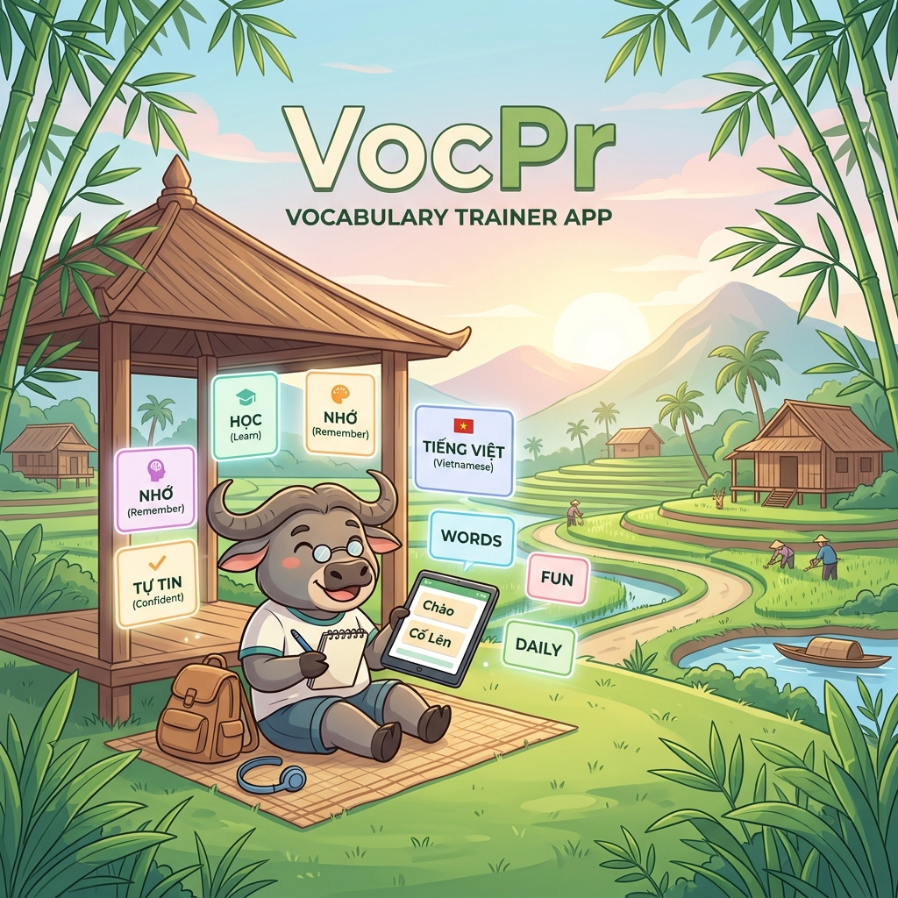
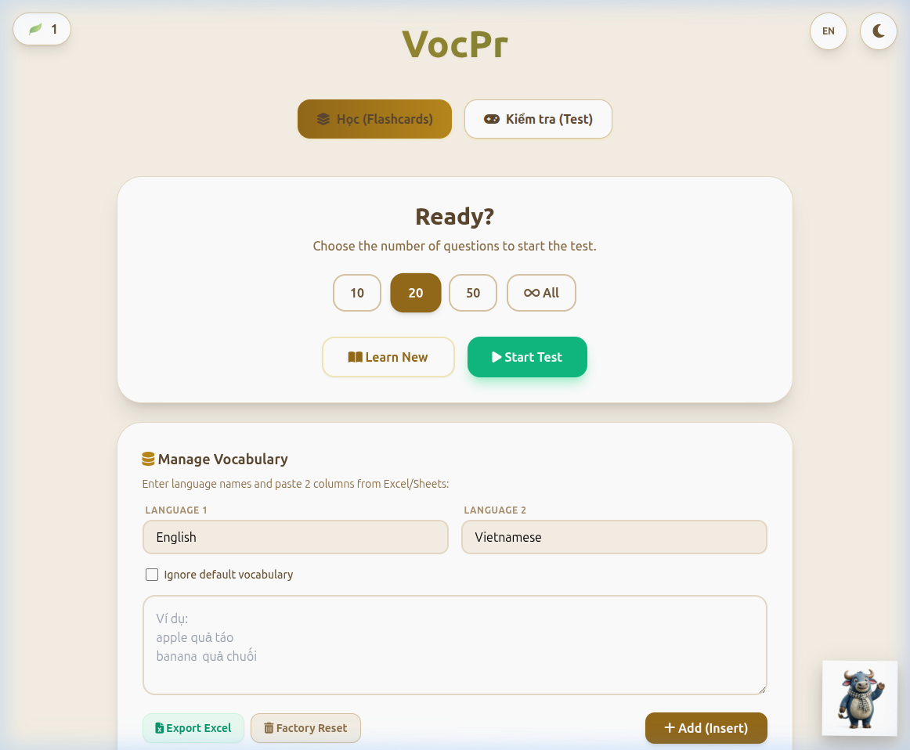

# 🎓 VocPr (Vocabulary Practice)

[Tiếng Việt](#tiếng-việt) | [English](#english)

---

## Tiếng Việt

Ứng dụng web học từ vựng đa ngôn ngữ ngoại tuyến. Hỗ trợ bất kỳ cặp ngôn ngữ nào (ví dụ: Anh-Việt, Trung-Nhật, v.v.) và chạy hoàn toàn trên trình duyệt, không yêu cầu thiết lập máy chủ.

### ✨ Các tính năng chính

- 📖 **Chế độ Học (Flashcards):** Xem từ vựng và nghĩa giữa hai ngôn ngữ bất kỳ với hiệu ứng lật thẻ tương tác.
- 📝 **Chế độ Kiểm tra (Test):** Đa dạng các loại bài tập giúp củng cố trí nhớ:
  - Nhập liệu (Typing)
  - Trắc nghiệm (Multiple Choice)
  - Ghép cặp (Matching)
- ⚙️ **Cấu hình bài thi:** Tùy chỉnh số lượng câu hỏi mỗi bài kiểm tra (10, 20, 50, hoặc tất cả).
- 📊 **Theo dõi lịch sử:** Tự động lưu kết quả bài thi và danh sách từ làm sai để ôn tập. Hỗ trợ tính năng xóa lịch sử học tập.
- 📥 **Quản lý từ vựng (Nhập/Xuất hàng loạt):**
  - Dễ dàng thêm hoặc cập nhật từ vựng bằng cách sao chép 2 cột dữ liệu từ Excel/Google Sheets và dán vào phần nhập liệu.
  - Tự động nhận diện và bổ sung nghĩa mới nếu từ vựng đã tồn tại.
- Xuất toàn bộ danh sách từ vựng hiện tại ra định dạng Excel (.tsv).

### 🖼️ Giao diện ứng dụng

### 📖 Hướng dẫn sử dụng

#### 1. Cách nạp từ vựng từ Excel/Google Sheets
Ứng dụng hỗ trợ nạp từ vựng hàng loạt rất nhanh chóng:
1. Chuẩn bị file Excel/Google Sheets với **2 cột** (Cột 1: Từ gốc, Cột 2: Nghĩa).
2. Quét chọn và **Copy** các dòng dữ liệu.
3. Trong ứng dụng, tại phần **Quản lý từ vựng**:
   - Nhập tên ngôn ngữ vào ô **Ngôn ngữ 1** (ví dụ: English) và **Ngôn ngữ 2** (ví dụ: Vietnamese).
   - Dán dữ liệu đã copy vào ô văn bản lớn.
   - Bấm nút **Thêm (Insert)**.
4. Kiểm tra lại dữ liệu trong bảng xem trước và bấm **Xác nhận Lưu**.

#### 2. Cách chuyển đổi bộ từ vựng (Ví dụ: Từ Anh-Việt sang Trung-Anh)
Để chuyển sang học một cặp ngôn ngữ hoàn toàn mới:
1. **Export Excel**: Xuất bộ từ vựng hiện tại ra file để lưu trữ.
2. **Xóa sạch dữ liệu (Reset)**: Bấm nút Reset để xóa dữ liệu cũ trong bộ nhớ trình duyệt.
3. Thực hiện các bước nạp từ vựng như trên với bộ từ mới (Trung - Anh).
*Lưu ý: Bạn cũng có thể tích chọn **"Bỏ qua từ vựng mặc định"** để chỉ tập trung vào các từ bạn đã nạp.*

#### 4. Phím tắt hữu ích
- **Chế độ Học (Learn):**
  - `Mũi tên Phải`: Sang từ tiếp theo.
  - `Mũi tên Trái`: Quay lại từ trước.
  - `Dấu cách` hoặc `Mũi tên Lên/Xuống`: Lật thẻ.
- **Chế độ Kiểm tra (Test):**
  - `Enter`: Nộp bài hoặc sang câu tiếp theo.

### 🚀 Cách chạy ứng dụng

Chỉ cần mở tệp **`index.html`** bằng bất kỳ trình duyệt web nào (Chrome, Firefox, Safari, Edge, v.v.).

### 💡 Lưu ý dành cho nhà phát triển

- Dữ liệu từ vựng mặc định được tải từ tệp `assets/vocab.js`.
- Tất cả dữ liệu phát sinh (lịch sử, từ làm sai, từ vựng tùy chỉnh) đều được lưu trữ hoàn toàn ở phía người dùng (client-side) thông qua `localStorage`.
- Giao diện được xây dựng tinh gọn bằng HTML/JS/CSS thuần kết hợp với Tailwind CSS (nhúng qua CDN).
- Để chỉnh sửa dữ liệu gốc một cách hệ thống, vui lòng sử dụng các script chuyển đổi trong thư mục `scripts/` tại repository gốc.

## 📜 Bản quyền & Tài sản

Dự án được phát hành dưới giấy phép [MIT License](LICENSE).

### Thư viện bên thứ ba (tải qua CDN)

- [Tailwind CSS](https://tailwindcss.com/) — MIT License
- [Font Awesome](https://fontawesome.com/) — Free icons (CC BY 4.0)
- [Chart.js](https://www.chartjs.org/) — MIT License
- [canvas-confetti](https://github.com/catdad/canvas-confetti) — ISC License

### Tài sản được tạo bởi AI

- `assets/buffalo_mascot.png` — Được tạo bởi Google Gemini (2026)
- `assets/bamboo_leaf.png` — Được tạo bởi Google Gemini (2026)
- `assets/banner.png` — Banner nghệ thuật được tạo bởi Google Gemini (2026)

> **Lưu ý:** Theo quy định của Văn phòng Bản quyền Hoa Kỳ (2023), các hình ảnh thuần túy do AI tạo ra có thể không thuộc đối tượng được bảo hộ bản quyền. Các tài sản này được cung cấp "nguyên trạng" cùng với mã nguồn giấy phép MIT. Người dùng có quyền tự do sử dụng, sửa đổi và phân phối lại.

### 🤝 Đóng góp (Contributors)

Dự án này được xây dựng với sự hỗ trợ đắc lực từ:
- **Google Gemini:** Thiết kế hình ảnh (assets), tối ưu hóa giao diện (UI/UX), vận hành dự án (Agent Project Operator) và tái cấu trúc hệ thống đa ngôn ngữ.
- **Anthropic Claude:** Xây dựng cấu trúc mã nguồn ban đầu, logic xử lý dữ liệu và các tính năng tương tác.

---

## English

A universal, offline web application for learning vocabulary in any language pair. It runs entirely in the browser without the need for additional server setup.

### ✨ Key Features

- 📖 **Learning Mode (Flashcards):** View vocabulary and meanings between any two languages with click/flip card interactions.
- 📝 **Test Mode:** Various exercise types to reinforce memory:
  - Typing (Written)
  - Multiple Choice
  - Matching
- ⚙️ **Test Configuration:** Users can customize the number of questions per test (10, 20, 50, or all).
- 📊 **History Tracking:** Automatically saves test results and incorrect words for review. Supports clearing study history.
- 📥 **Vocabulary Management (Bulk Import / Export):**
  - Easily add or update vocabulary in bulk by copying any 2 columns of data from Excel/Google Sheets and pasting them into the import section.
  - Automatically recognizes and adds new meanings if the word already exists.
  - Export the entire current vocabulary list to Excel (.tsv) format.

### 🖼️ Application Interface

### 📖 User Guide

#### 1. Importing Vocabulary from Excel/Google Sheets
The app supports fast bulk import:
1. Prepare an Excel or Google Sheets file with **2 columns** (Column 1: Term, Column 2: Meaning).
2. Select and **Copy** the data rows.
3. In the app, under **Manage Vocabulary**:
   - Enter language names in the **Language 1** (e.g., English) and **Language 2** (e.g., Chinese) fields.
   - Paste the copied data into the large text area.
   - Click **Add (Insert)**.
4. Review the data in the preview table and click **Confirm Import**.

#### 2. Switching Between Language Pairs (e.g., English-Vietnamese to Chinese-English)
To switch to an entirely new set of languages:
1. **Export Excel**: Export your current vocabulary to a file for backup.
2. **Factory Reset**: Click the Reset button to clear old data from the browser storage.
3. Follow the import steps above for the new pair (Chinese - English).
*Tip: Check **"Ignore default vocabulary"** to focus only on your imported words.*

#### 4. Useful Keyboard Shortcuts
- **Learning Mode (Learn):**
  - `Right Arrow`: Next word.
  - `Left Arrow`: Previous word.
  - `Space` or `Up/Down Arrow`: Flip card.
- **Test Mode:**
  - `Enter`: Submit answer or go to the next question.

### 🚀 How to Run the App

Simply open the **`index.html`** file with any web browser (Chrome, Firefox, Safari, Edge, etc.).

### 💡 Developer Notes

- Default vocabulary data is loaded from `assets/vocab.js`.
- All data generated during use, including test history, incorrect word lists, and new vocabulary (custom_vocab), is stored entirely on the client-side using `localStorage`.
- The interface is built simply and friendly using pure HTML/JS/CSS along with Tailwind CSS (included via CDN).
- If you want to modify the original vocabulary data properly, use the data conversion script located in the `scripts/` directory in the root repository.

---

## 📜 License & Asset Credits

This project is released under the [MIT License](LICENSE).

### Third-party Libraries (loaded via CDN)

- [Tailwind CSS](https://tailwindcss.com/) — MIT License
- [Font Awesome](https://fontawesome.com/) — Free icons (CC BY 4.0)
- [Chart.js](https://www.chartjs.org/) — MIT License
- [canvas-confetti](https://github.com/catdad/canvas-confetti) — ISC License

### AI-Generated Assets

- `assets/buffalo_mascot.png` — Generated using Google Gemini (2026)
- `assets/bamboo_leaf.png` — Generated using Google Gemini (2026)
- `assets/banner.png` — Artistic banner generated using Google Gemini (2026)

> **Note:** Per the US Copyright Office (2023), purely AI-generated images may not be eligible for copyright protection. These assets are provided "as-is" alongside the MIT-licensed source code. Users are free to use, modify, and redistribute them.

### 🤝 Contributors

This project was built with the invaluable support of:
- **Google Gemini:** Asset design, UI/UX optimization, Project Operation (Agent Project Operator), and multilingual architecture refactoring.
- **Anthropic Claude:** Core initial structure, data processing logic, and interactive features.

---

*Chúc bạn học tốt! / Happy learning!*
